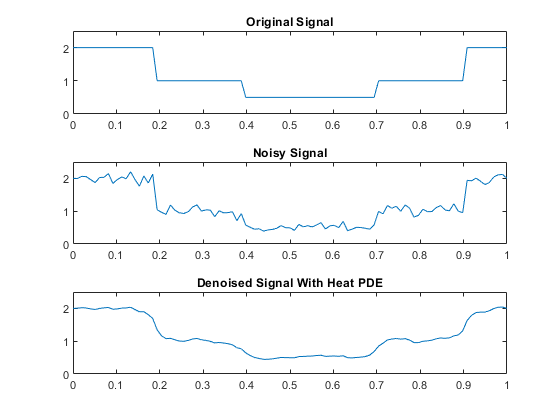
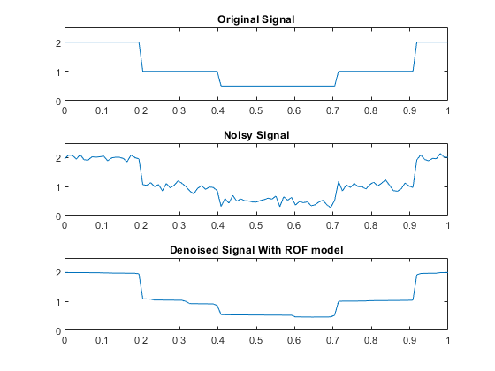
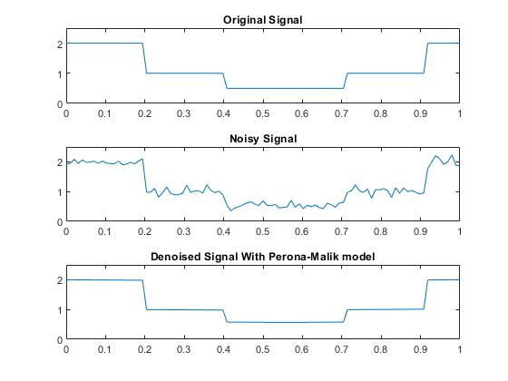
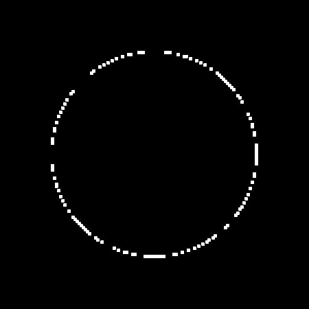

# PDE's for Image Processing
Matlab implementation of partial differential equation (PDE) models for denoising, segmentation and inpainting.

# Denoising

In order to enhance the quality of noisy images, diffusion based PDEs may be used. The following models are used and implemented in a 1D signal for simplicity:

## Heat Equation Denoising

The linear PDE given by:

$$\begin{cases} u_t - k\Delta u = 0 \\
u(x,0) = u_0(x) \text{ (the noisy image) }
\end{cases}$$

Is equivalent to the Gaussian filtering, as the solution of the heat equation is given by the convolution of the initial conditions owith the heat kernel $\Phi(x,t) = \frac{1}{(4\pi k)^{n/2}} e^{-\frac{x^2}{4kt}}$ with $x \in \mathbb{R}^n$ (naturally $n=2$ with images). So the solution is given by:

$$u(x,t) = \int_\Omega \Phi(x-s,t) u_0(s)ds$$

This solution can be also done discretizing the PDE and applying it to the noisy image. For this purpose, we can expand the equaiton in order to make the process adding the term $\lambda (u-u_0)$, getting the equation:

$$u_t - k\Delta u = \lambda (u-u_0)$$

Discretizing the equation with the forward Euler method, as it is simplest, we get:

$$u_j^{n+1} = u_j^n + dt ( k \frac{u_{j-1}^n -2 u_j^n + u_{j+1}^n}{h^2} + \lambda (u_j^n- u_{0_{j}}^n))$$

Here $dt$ represents the time step, $h$ the space step, $n$ the time point and $j$ the space point. We also have to take into account boundary conditions, where we assume $u(x,t)=0$ in $\partial \Omega$.

  

## Fourth Order PDE

Simmilarly to the previous method, we can use a higher order linear PDE to denoise the image. This method does a better job at preverving the important characteristics, but it still blurs the image. However, higher order PDEs can be used with other non linear equations to potentially give better results. The 4th order linear PDE is given by:

$$u_t = u_{xxxx} + \lambda(u-u_0)$$

With the same boundary and initial conditions. The forward Euler discretization is given by:

$$u_j^{n+1} = u_j^n + dt(D \frac{u_{j-2}^n -4 u_{j-1}^n + 6 u_j^n - 4 u_{j+1}^n + u_{j+2}^n}{h^4} + \lambda(u_j^n - u_{0_j}^n))$$

  

## Total Variation Denoising

The total variation denoising denoising using Rudin-Osher-Fatemi (ROF) PDE, seeks to denoise the image whilst maintaning important details such as edges by solve the following minimization problem:

$$\min_{u \in BV( \Omega)} \int_\Omega \|| \nabla u \|| + \frac{\lambda}{2} (u-u_0)^2dx$$

Where $BV(\Omega)$ is the set of functions with bounded variation (finite total variation) over the domain. Here $u_0$ represents the noisy image. Appling the Euler-Lagrange Equation to this functional, we get the PDE:

$$div (\frac{\nabla u}{\|| \nabla u\|| }) + \frac{\lambda}{2} (u-u_0) = 0 $$

We can take the equivalenmt time dependent PDE and iterate over time:

$$u_t =div (\frac{\nabla u}{\|| \nabla u\|| }) + \frac{\lambda}{2} (u-u_0)$$

Discritezing the PDE with forward Euler method and assuming the previous assumptions at the border:

$$u_j^{n+1} = u_j^n + dt \left( \frac{\nabla^+ u}{\sqrt{(\nabla^+ u)^2 + \epsilon}} - \frac{\nabla^- u}{\sqrt{(\nabla^- u)^2 + \epsilon} } + \lambda (u_j^n - u_{0_j}^n)\right)$$

Where $\nabla^+ u = \frac{u_{j+1}^n-u_j^n}{h}, \nabla^- u = \frac{u_{j}^n-u_{j-1}^n}{h}$ correspond to the forward difference and backward difference operator. The value $\epsilon > 0$ is used to prevent division by 0.

  

## Anisotropic Diffusion

The anisotropic diffusion or Perona-Malik model, is an image denoising process that is good at preserving important image details as it tends to maintain the edges and lines sharp, contrary to gaussian filtering that tends to blur the edges. The process is defined b:

$$u_t = div\[g(\nabla u) \nabla u \]$$

$g(\nabla u)$ controls the rate of diffusion and is usually chosen as a function of the image gradient so as to preserve edges in the image. The two functions for $g(\cdot)$ proposed b Pietro Perona and Jitendra Malik are:

$$g(\nabla u) = \frac{1}{1+\left( \frac{\nabla u}{K} \right)^2 }$$

and

$$g(\nabla u) =e^{-\left( \frac{\nabla u}{K} \right)^2} $$

The forward Euler discretization is given by:

$$u_j^{n+1} =u_j^n + dt(g(\nabla^+ u)\nabla^+ u - g(\nabla^- u)\nabla^- u)$$

  

# Segmentation

## Level Set Methods

In order to partition an image into multiple segments, we have to define boundaries on the image. In 1988, James A. Sethian and Stanley Osher proposed to represent these boundaries implicitly and model their propagation using PDEs.

In two dimensions, the level set method consists of representing a curve $\Gamma$ as the zero level set of a some function $\varphi$, called the level set function. Thus $\Gamma$ is defined as:
$$\Gamma =\\{ (x,y) \| \varphi(x,y)=0\\} $$

Defining $\varphi$ as an evolution PDE, the boundary given by $\Gamma$ is manipulated and evolves throughout the process. To make this work, if we take some velocity field $v$, we can propagate the zero level set using the advection equation:

$$\varphi_t + v \cdot \nabla \varphi=0$$

This can be exemplified by the inward motion of the following circunference. 

  

The circunference represents the evolution of the zero level set using the previous equation, as the the interior of the circunference has positive gradient and the exterior negative. To achieve a stable motion, the equation was discretized using the Lax-Friedrichs method in two dimentions. The method for the advection equation (in one dimention) is given by:

$$\frac{\varphi_j^{n+1}-\frac{1}{2}(\varphi_{j-1}^n + \varphi_{j+1}^n)}{\Delta t} + v\frac{\varphi_{j-1}^n + \varphi_{j+1}^n}{2h}=0 \iff$$

$$\iff \varphi_j^{n+1} = \frac{1}{2}(1+\lambda)\varphi_{j-1}^n + \frac{1}{2}(1-\lambda)\varphi_{j+1}^n$$

With $\lambda = v\frac{\Delta t}{h}$. Now, in order to create motion in the normal direction, we take the velocity field do be a linear combination the normal vector $n =\frac{\nabla \varphi}{\|\varphi\|}$ to $\Gamma$. So taking $v=Fn$ and substituting in the advection equation we get:

$$\varphi_t + F\|\nabla \varphi\|=0 $$

This is due to $\nabla \varphi \cdot \nabla \varphi=\|\nabla \varphi\|^2$. This equation can be discretized by the following process:

$$\varphi_{i,j}^{t+1} = \varphi^{t}_{i,j} + dt \left( \max{(F,0)}G^+\_{i,j} + \min{(F,0)}G^-\_{i,j}\right) $$

With

$$G^+_{i,j} = \left[ \max{(\nabla^-_x,0)}^2+\min{(\nabla^+_x,0)}^2  + \max{(\nabla^-_y,0)}^2+\min{(\nabla^+_y,0)}^2 \right] $$

$$G^-_{i,j} = \left[ \min{(\nabla^-_x,0)}^2+\max{(\nabla^+_x,0)}^2  + \min{(\nabla^-_y,0)}^2+\max{(\nabla^+_y,0)}^2 \right] $$
